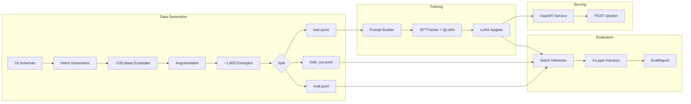
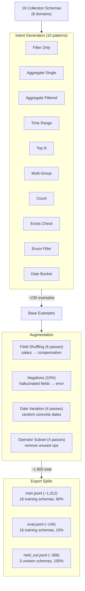
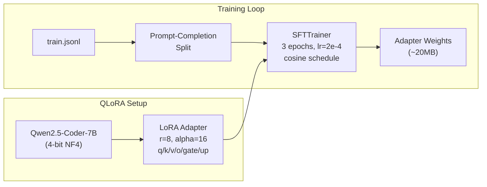
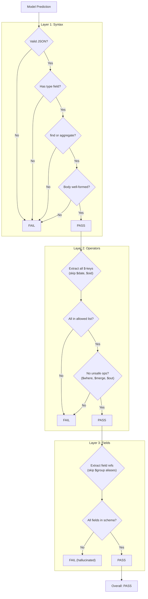
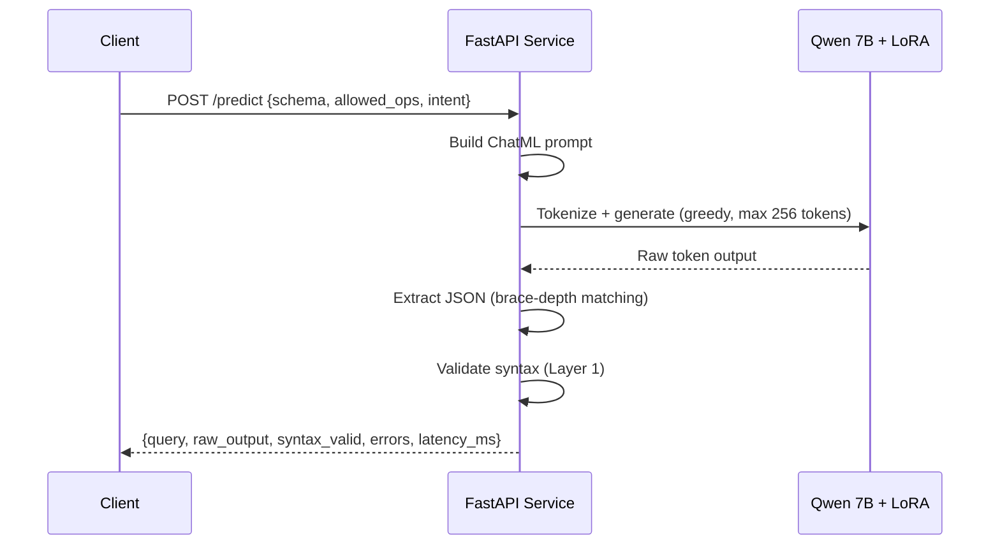

# Architecture

## System Overview



## Data Generation Pipeline



Each generator reads the schema's field roles to decide applicability. A schema needs a `measure` and a `category` field for aggregation patterns, a `timestamp` for time range queries, an `enum` for `$in` filters, etc. The intent is generated from randomized natural language templates, and the ground-truth MongoDB query is built programmatically — no LLM in the loop.

## Training Example Format

Each example is a JSON object with four components:

```json
{
  "schema": {
    "collection": "orders",
    "domain": "ecommerce",
    "fields": [
      {"name": "total_amount", "type": "double", "role": "measure", "description": "Order total in USD"},
      {"name": "status", "type": "string", "role": "enum", "description": "Order status",
       "enum_values": ["pending", "shipped", "delivered", "cancelled"]}
    ]
  },
  "allowed_ops": {
    "stage_operators": ["$match", "$group", "$sort"],
    "expression_operators": ["$sum", "$avg", "$eq", "$gt"]
  },
  "intent": "Find all pending orders",
  "output": {"type": "find", "filter": {"status": "pending"}}
}
```

The prompt builder renders this into ChatML format:

```
<|im_start|>system
You are a MongoDB query generator. Given a collection schema...
<|im_end|>
<|im_start|>user
Collection: orders
Fields:
  - total_amount (double, measure): Order total in USD
  - status (string, enum): Order status [values: pending, shipped, delivered, cancelled]

Allowed stage operators: $match, $group, $sort
Allowed expression operators: $sum, $avg, $eq, $gt

Intent: Find all pending orders
<|im_end|>
<|im_start|>assistant
{"type": "find", "filter": {"status": "pending"}}<|im_end|>
```

During training, prompt tokens are masked from the loss — the model only learns to generate the query JSON.

## Training Pipeline



The base model weights stay frozen in 4-bit precision. Only the LoRA adapter parameters (~0.1% of total) are trained. The adapter is saved separately and loaded at inference time via `PeftModel` — it cannot be merged into quantized weights.

## Evaluation Harness



Layers are sequential — if syntax fails, operators and fields are skipped. The fourth layer (generalization) operates across the full result set, comparing pass rates between training and held-out schemas.

## Inference Service



The service loads the base model in 4-bit precision and applies the LoRA adapter on startup. Generation uses greedy decoding (no sampling) for deterministic output. The `extract_json` function handles noisy model output by finding the first balanced JSON object using brace-depth tracking.

## Key Constraints

**Short schema descriptions**: The model was trained on field descriptions of 2-5 words. Longer descriptions cause it to hallucinate operator lists instead of generating queries. This is a hard constraint — inference prompts must match training prompt length.

**No merge for 4-bit models**: `merge_and_unload()` on a 4-bit quantized model silently produces garbage weights. The adapter must stay as a `PeftModel` wrapper at runtime.

**Field semantic roles**: The role annotation (`identifier`, `measure`, `timestamp`, `category`, `enum`, `boolean`, `text`) is what teaches the model which fields to group by, which to sum, which to filter on. Without roles, the model has to guess from field names alone.
